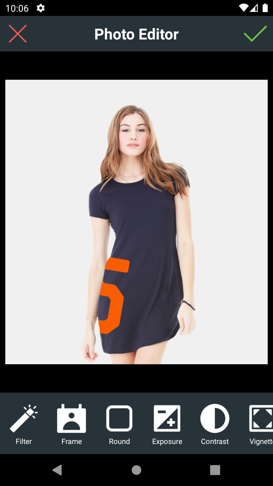

# PicsEditor

This application can be used for editing images.
This application uses DS PhotoEditor SDK for editing images.
You can create your images attractive by following features :
~~~
Apply various Filters
Adjust Contrast, Brightness, Exposure, Saturation
Add Frames
Add Texts
Add Vignette effects
Pixelate
Draw 
Stickers
~~~

**Here are screenshots**

